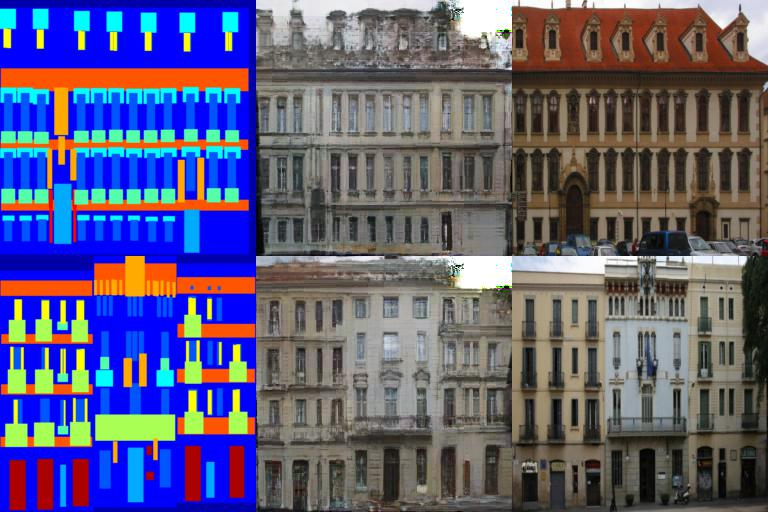

# ASAP_pytorch_implementation
This is a casual pytorch implementation of [spatially-adaptive pixelwise network for fast image translation](https://tamarott.github.io/ASAPNet_web/)

I tested the code in database of [CMP Facade Database](https://cmp.felk.cvut.cz/~tylecr1/facade/)

I provided a sample [checkpoint](https://drive.google.com/drive/folders/1OY7EZjVv7LUrQPRZymd_VlKbzwSLxvyX?usp=sharing) which generate the following result example.

## A result sample

Still some issues left to solve:
1. In a single NVIDIA GenForce GTX 1080ti, the maximum image size can only be set to 256 x 256  
2. Some artifacts remain in the right conner that may disappear if keep on training.  

